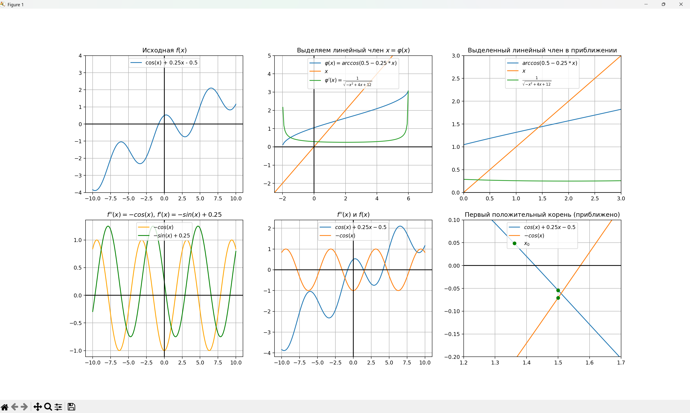
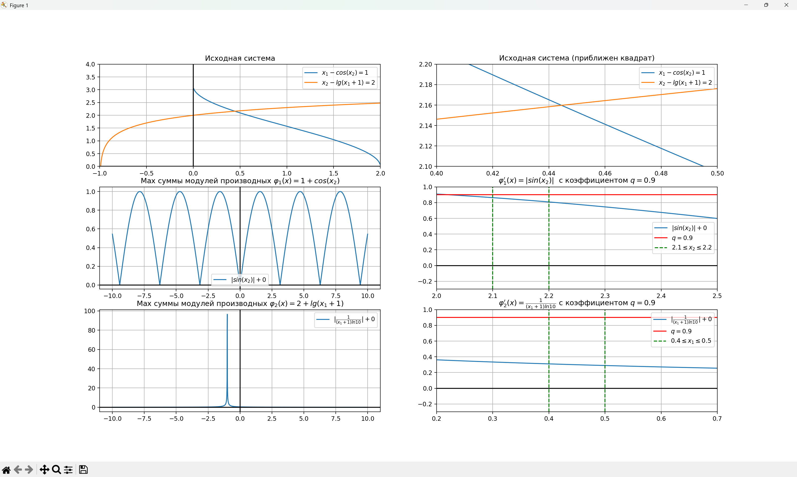
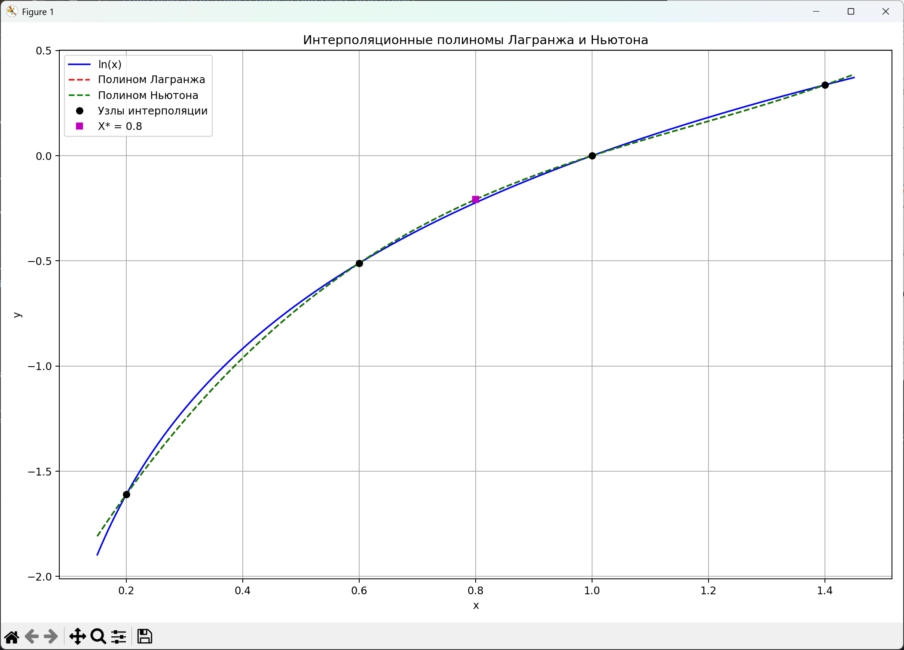
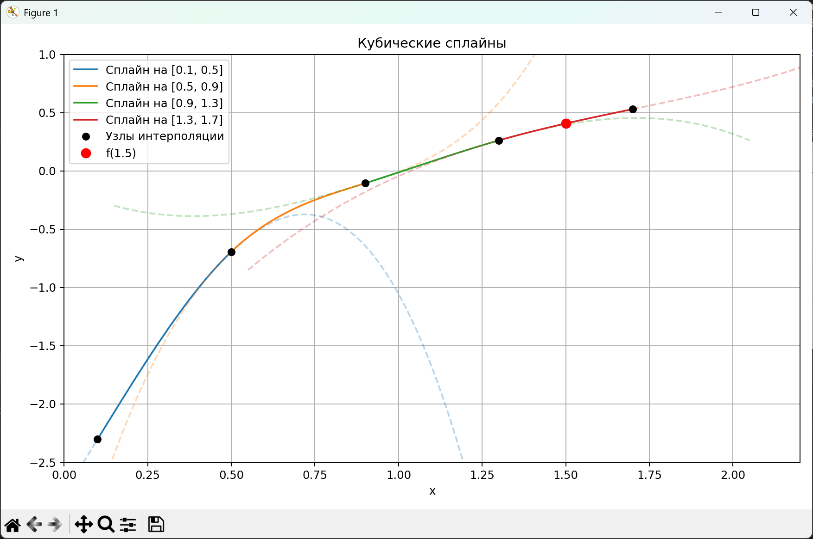
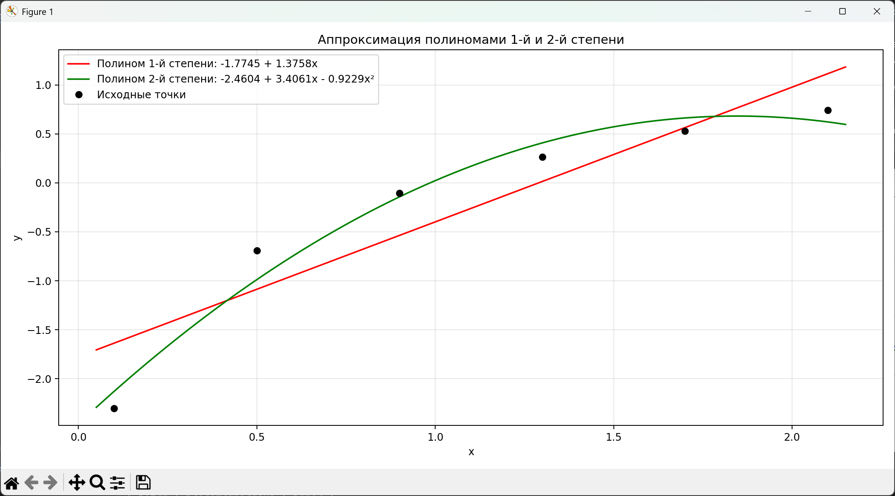
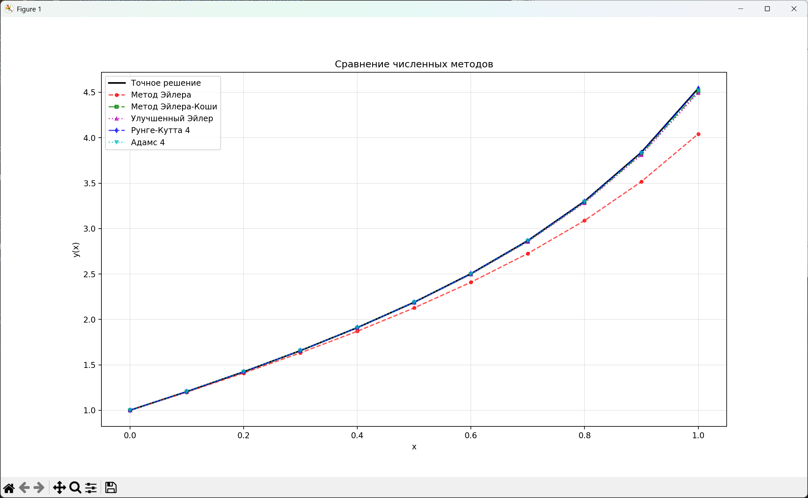
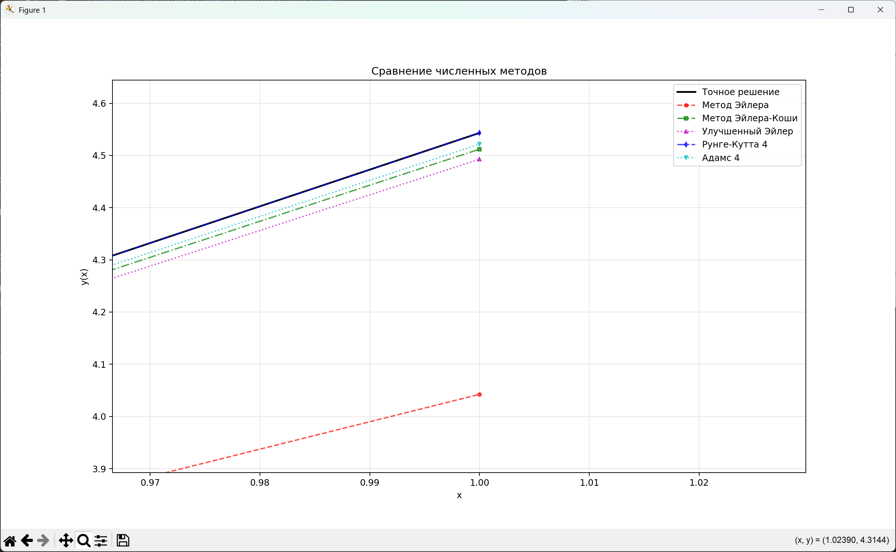
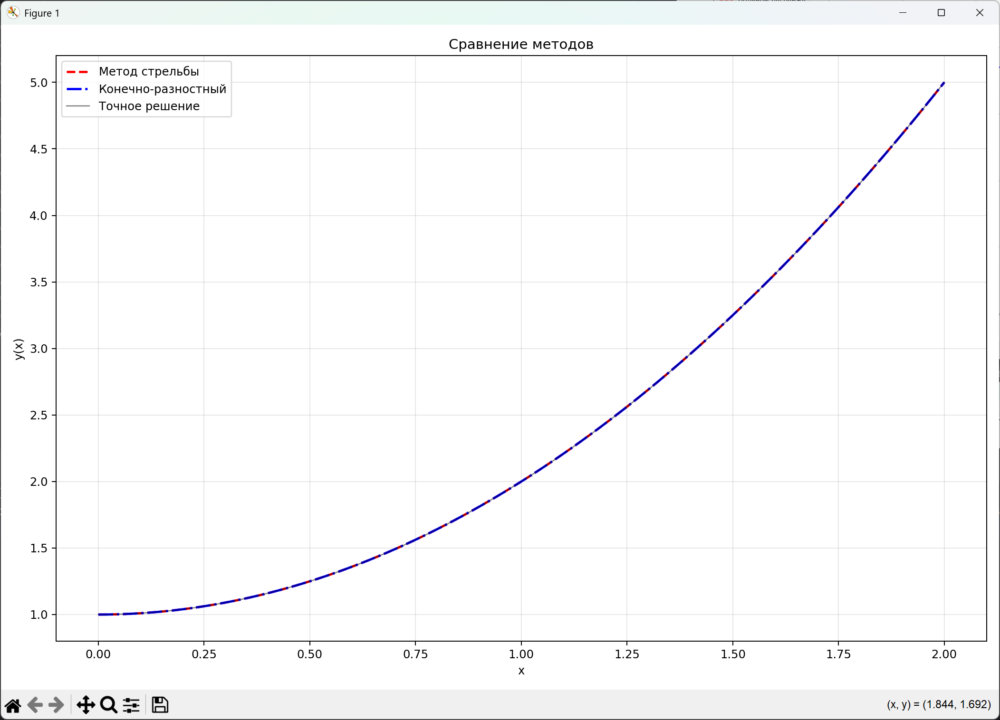
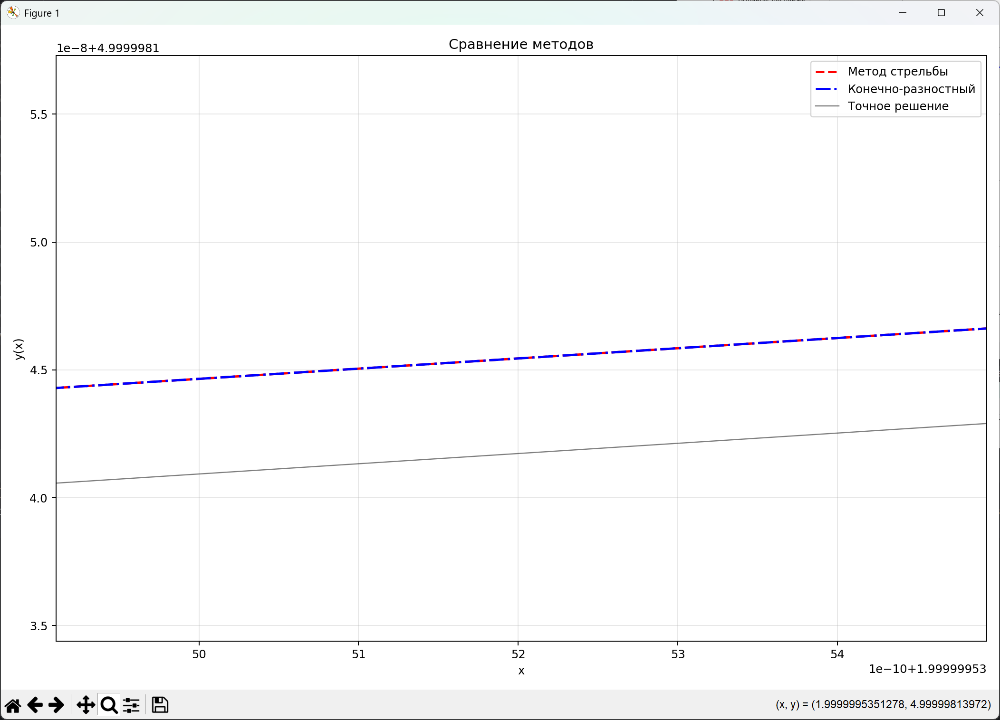

# Численные методы для решения различных родов задач
## Лабораторная №1. Методы решения задач линейной алгебры.
В данной работе решаются СЛАУ и находятся собственные значения.

Для работы с матрицами написана собственная библиотека с классом Matrix. Функционал описан в папке utils.

Использованные методы:
1. **LU-разложение** (LU-Decomposition) матриц с выбором главного элемента (LUP-разложение). 
Данный метод позволяет не только решить СЛАУ, но и найти обратный элемент и определитель более эффективно. 
Сложность: $O(n^3)$.
2. **Метод прогонки** (Thomas algorithm). Позволяет решать СЛАУ с трехдиагональными матрицами. 
Сложность: $O(n)$.
3. **Метод простых итераций и Зейделя** (Simple iterations and Seidel methods). Итеративные методы для решения СЛАУ.
Упрощают решение при большом количестве уравнений. _Необходимо задавать точность epsilon_. Сложность: $O(kn^2)$, где $k$ - число итераций.
4. **QR-разложение** (QR-Decomposition). На основе QR-разложения был реализован QR-алгоритм решения полной проблемы собственных значений произвольных матриц. _Необходимо задавать точность epsilon._ Сложность: $O()$.

Во всех лабораторных были реализованы методы для считывания данных из файла для удобства воспроизводимости результата.

## Лабораторная №2. Методы решения нелинейных уравнений и систем нелинейных уравнений.
Использованные методы:
1. **Метод простой итерации и Ньютона** (Simple iterations and Newton methods). _Необходимо задавать точность epsilon._ 
Для работы методов необходимо найти графически начальное приближение $x_0$ (для системы - вектор начальных приближений). Для метода простых итераций также требуется $q$ (см. Теорему 1). Для метода Ньютона необходимо вычислить производные или матрицу Якоби (для системы).
    
    _Теорема 1. Пусть функция $\varphi(x)$ определена и дифференцируема на отрезке $[a,b]$. Тогда если
выполняются условия:_
   - $\varphi(x) ∈ [a,b]. \forall x ∈ [a,b]$ 
   - $\exists q: |\varphi'(x)| \le q < 1; \forall x ∈ [a,b]$

    _то уравнение имеет и притом единственный на $[a,b]$ корень $x^{(*)}$._

Графики программ:
1. 
2. 

## Лабораторная №3. Методы приближения функций. Численное дифференцирование и интегрирование.
Использованные методы:
1. **Интерполяционные многочлены Лагранжа и Ньютона**. С помощью векторов $x$ и $f(x)$ находит многочлены, проходящие через эти точки. Вычисляет погрешность интерполяции в точке $x^*$.
2. **Кубический сплайн** (Cubic spline) для функции, заданной в узлах интерполяции, предполагая, что сплайн имеет нулевую кривизну при $x=x_0$ и $x=x_4$. Вычисляет значение в точке $x=X^*$.
3. **Приближающие многочлены 1 и 2 степени через решение нормальной системы МНК.** Находит сумму квадратов ошибок.
4. **Первая и вторая производные**. Функция задается через вектор $x, y=f(x)$. Находит значение в точке $x=x^*$.
5. **Вычисление определенного интеграла методами прямоугольников, трапеций и Симпсона**. Необходимо задать шаг h для вычислений. Возможно измерить ошибку методом Рунге-Ромберга для $h_1$, $h_2$.

Результаты работы и графики программ:
1. `Lagrange Polynomial:
4.19124(x - 0.6)(x - 1.0)(x - 1.4) - 3.99083(x - 0.2)(x - 1.0)(x - 1.4) + 0.87623(x - 0.2)(x - 0.6)(x - 1.0)
Result in X*: -0.207779`

   `Newton Polynomial
\- 1.60944 + 2.74653(x - 0.2) - 1.83683(x - 0.2)(x - 0.6) + 1.07665(x - 0.2)(x - 0.6)(x - 1.0)
  Result in X*: -0.207779`

2. `0.262360 + 0.816490(x - 1.3) + -0.546807(x - 1.3)^2 + 0.455672(x - 1.3)^3
f(1.5) = 0.407431`

3. `First degree approximation polynomial:
   -1.7745 + 1.3758x.
   Square Error: 0.9854`

   `Second degree approximation polynomial:
   -2.4604 + 3.4061x - 0.9229x^2.
   Square Error: 0.1714`
   

## Лабораторная №4. Методы решения начальных и краевых задач для обыкновенных дифференциальных уравнений (ОДУ) и систем ОДУ.
Использованные методы:
1. **Явный метод Эйлера, метод Эйлера-Коши, первый улучшенный метод Эйлера, методы Рунге-Кутты и Адамса 4-х порядков**. Решают задачу Коши для ОДУ 2-го порядка на указанном отрезке. Возможно оценить погрешность с помощью метода Рунге-Ромберга. Метод Адамса разгоняется с помощью метода Рунге-Кутты.
2. **Метод стрельбы и конечно-разностный метод**. Решают краевую задачу для ОДУ 2-го порядка.

Графики программ:
1. 
   
2. 
   

Погрешности программ:
1. ```
   ============================================================
   Оценка погрешности методом Рунге-Ромберга:
   Метод                               Оценка Рунге-Ромберга
   -----------------------------------------------------------------
   Метод Эйлера (p=1)                         0.3194076943
   Метод Эйлера-Коши (p=2)                0.0263936950
   Улучшенный метод Эйлера (p=2)              0.0376050740
   Метод Рунге-Кутты (p=4)                0.0001252289
   Метод Адамса (p=4)                         0.0055229913
   ```
2. ```
   Метод стрельбы сошелся за 1 итераций
   y(0) = 1
   Метод             | Абс погрешность | Рунге-Ромберг
   ---------------------------------------------------
   Метод стрельбы    | 9.22634e-10     | 1.34102e-09
   Конечно-разностный| 4.99156e-12     | 1.9984e-12
   ```